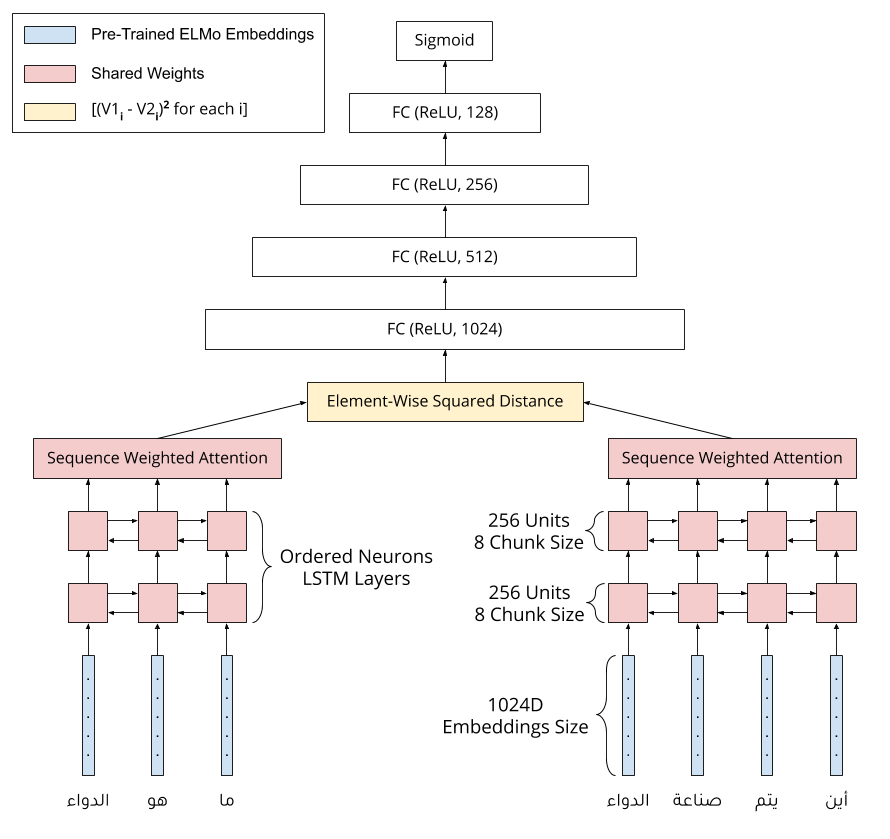

# mawdoo3-task

Official implementation of: [Semantic Text Similarity Using Squared Distance Contextual Ordered Neurons LSTM With Weighted Attention](paper-url)

Note: All codes and scripts in this repository tested on Ubuntu 18.04 LTS.

## 0. Prerequisites
- Python 3.6.8
- Packages listed in `requirements.txt` file
- To use ELMo embeddings:
	- Clone this repository: https://github.com/HIT-SCIR/ELMoForManyLangs
	- Inside the folder of the cloned repository, run the following command: `python setup.py install`
  - Download and unzip the Arabic ELMo pre-trained model from: https://github.com/HIT-SCIR/ELMoForManyLangs into `elmo_dir` folder
  - Download this file: https://github.com/HIT-SCIR/ELMoForManyLangs/blob/master/configs/cnn_50_100_512_4096_sample.json and save it in `elmo_dir` folder

## 1. Data Preprocessing
To preprocess the data run the following commands:
```
python 1_preprocess.py --dataset-split train
python 1_preprocess.py --dataset-split test
```

## 2. Data Enlarging
To enlarge the data using the graph connected components extracted from the training data run the following command:
```
python 2_enlarge.py
```

## 3. Generating Words Embeddings
Before start the training of the model you need to generate the words embeddings using either *ELMo* or *BERT* pre-trained models to make the training process faster instead of generating the embeddings vectors for each individual batch separately while training.

To generate the embeddings pickle file containing the *ELMo* embeddings run the following command:
```
python 3_build_embeddings_dict.py --embeddings-type elmo
```
And to generate the embeddings pickle file containing the *BERT* embeddings run the following command:
```
python 3_build_embeddings_dict.py --embeddings-type bert
```

**Note that *ELMo* embeddings achieved better performance than *BERT* due to the lack of a good pre-trained Arabic *BERT* model.**

## 4. Model Training
To start training the model run the following command:
```
python 4_train.py --embeddings-type elmo --dropout-rate 0.2 --epochs 100 --batch-size 256 --dev-split 2000
```
You can use the command-line arguments to change the training hyperparameters, for example you can set `--embeddings-type` to `bert` to train the model using *BERT* embeddings.

## 5. Model Inferencing
To inference the model and predict the test set run the following command:
```
python 5_infer.py --model-path checkpoints/epoch100.h5
```
You can set the `--model-path` to any path pointing to a model checkpoint. This script by default uses `0.5` threshold, you can change it using `--threshold` argument

## Model Structure

The following figure shows the model structure in a clearer way.

